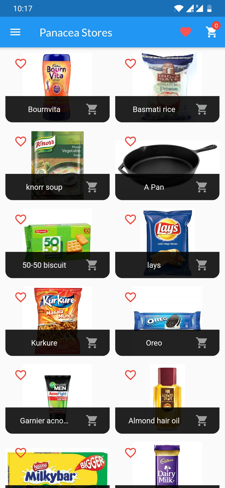
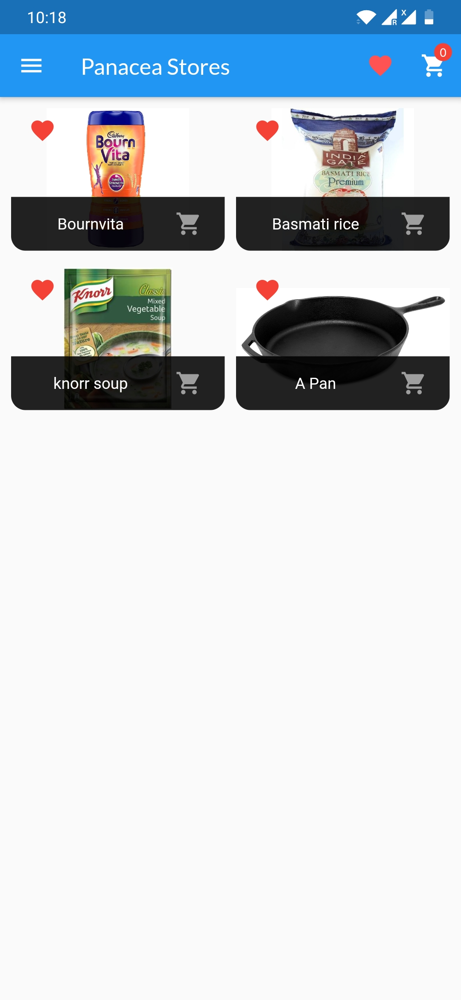
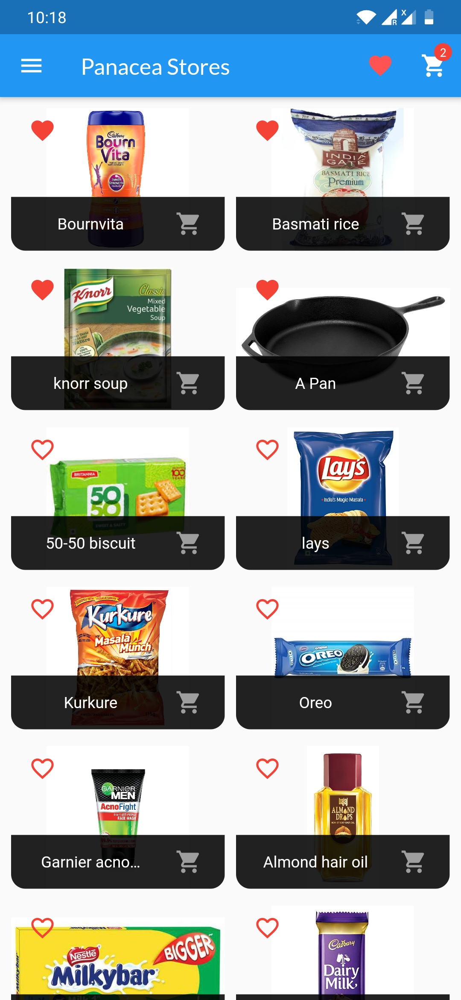
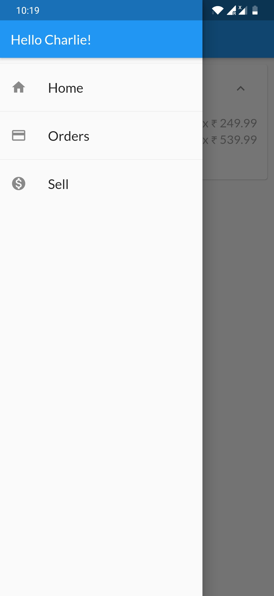
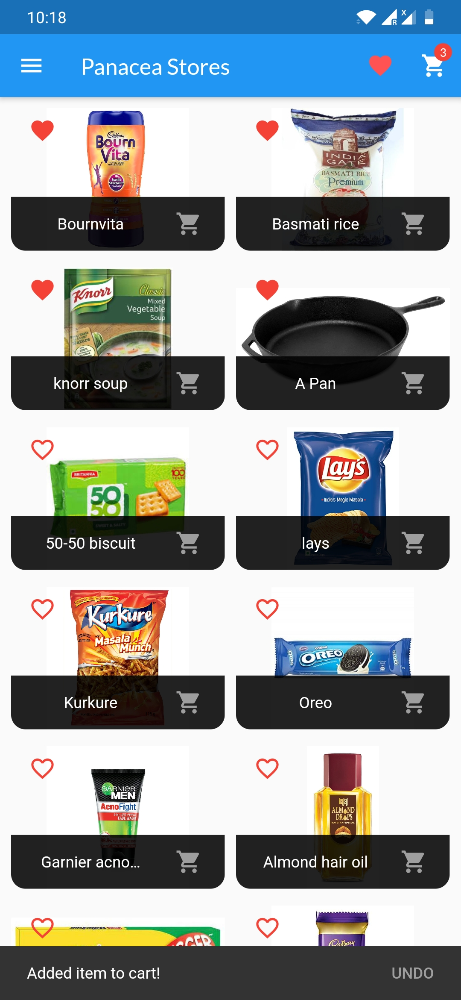

# Panacea Stores

A **Grocery App**. This project is a  a Flutter application.[Download](https://github.com/sauravchaudharysc/Panacea-Stores/raw/main/Panacea_Stores_base.apk)

## Over-View

### Screens

 #### 1. Home(Favorite Products)

##### Features

###	i. Adding Items to Wishlist. 

### ii. Showing WishListed items.

### iii. Adding Items to Cart &Increase count on Cart Icon.

### iv. Navigating to Cart Screen.

### v. Navigating to Product Detail Screen.

### vi. App Drawer.

 vii. SnackBar to Undo Cart Added Items.

#### 2. Cart

##### Features

​    i. Removing Items From Cart. 

   ii. Placing Order.

  iii. Alert Dialog Box.

#### 3. Orders

##### Features

​    i. Details of Item Ordered

#### 4. Sell

##### Features

​    i. Add an Item to Sell. 

   ii. Validating Items.

  iii. Updating Items.

  iv. Deleting Items.

  v. SnackBar to Notify Deleted Items.
